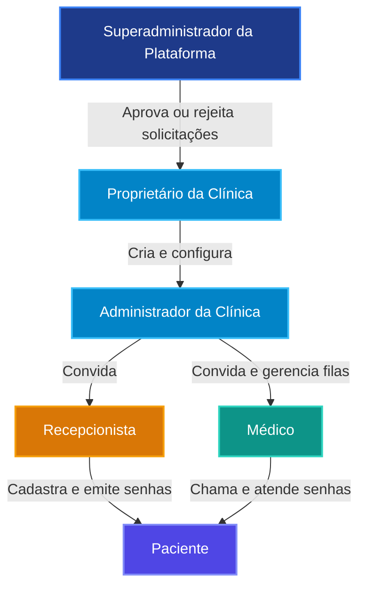

# MedFlow — Documentação Técnica Completa

Bem-vindo ao centro oficial de documentação do **MedFlow**, um sistema moderno, seguro e de alta performance para gestão de fluxo de atendimento em clínicas médicas.

---

## 🧭 Mapa da Documentação

A documentação do MedFlow está estruturada em guias especializados cobrindo todos os aspectos técnicos, operacionais e de conformidade do projeto:

| Documento | Descrição | Público-alvo |
|---|---|---|
| 📐 [**Arquitetura do Sistema**](file:///home/laurencampos/Documentos/MedFlow/docs/arquitetura.md) | Visão geral da engenharia, separação em camadas, padrão multi-tenant, segurança sem `service_role` e diagramas C4 | Arquitetos, Engenheiros de Software e DevOps |
| 🗄️ [**Banco de Dados & Dicionário de Dados**](file:///home/laurencampos/Documentos/MedFlow/docs/banco-de-dados.md) | Modelo relacional, schemas `public` e `private`, tabelas, constraints compostas, triggers, RLS policies detalhadas e RPCs | DBAs, Engenheiros Backend e Segurança |
| 🔌 [**Referência Completa da API**](file:///home/laurencampos/Documentos/MedFlow/docs/api.md) | Catálogo de endpoints HTTP REST, headers, autenticação Bearer, schemas de payload/resposta, erros e rate limiting | Desenvolvedores Frontend, Backend e Integradores |
| 🖥️ [**Frontend & Experiência do Usuário**](file:///home/laurencampos/Documentos/MedFlow/docs/frontend.md) | Arquitetura SPA Vanilla JS, gerenciamento de estado e sessão, roteamento por papel, polling e guia de telas | Desenvolvedores Frontend, UX/UI e Suporte |
| 🔒 [**Segurança, Privacidade & LGPD**](file:///home/laurencampos/Documentos/MedFlow/docs/seguranca-e-conformidade.md) | Modelo de ameaças, tokens opacos com hash SHA-256, isolamento estrito de dados, trilhas de auditoria e conformidade LGPD | Oficiais de Segurança (CISO), DPO e Jurídico |
| 🚀 [**Implantação, Configuração & Operação**](file:///home/laurencampos/Documentos/MedFlow/docs/implantacao-e-operacao.md) | Guia passo a passo de setup local, serviço systemd, deploy Vercel e PHP 8.3/FPM, variáveis de ambiente e runbook operacional | DevOps, SysAdmins e Operações |
| 🧪 [**Estratégia & Execução de Testes**](file:///home/laurencampos/Documentos/MedFlow/docs/testes.md) | Cobertura de testes unitários, testes de contrato backend, testes E2E Playwright, isolamento RLS e concorrência multithread | Engenheiros de QA e Desenvolvedores |

---

## ⚡ Visão Geral do Sistema

O MedFlow é projetado com o princípio fundamental de **privacidade por desenho (*privacy-by-design*)** e **mínimo privilégio**:

- **Foco do Negócio:** Organização de filas de recepção, chamadas de senhas para consultórios, acompanhamento em tempo real para pacientes e gestão multi-clínica da plataforma.
- **Não Armazena Prontuários nem CPF:** O sistema intencionalmente não coleta registros médicos confidenciais (prontuários, diagnósticos, anamnese) nem números de documentos sensíveis como CPF, reduzindo a superfície de risco à privacidade do paciente.
- **Multi-Tenant com Isolamento RLS:** Cada clínica é rigorosamente isolada. Usuários só enxergam dados das clínicas nas quais possuem vínculo ativo confirmado.
- **Zero Segredos Elevados no Backend (`service_role` proibido):** A API PHP funciona como um gateway validador e limitador de taxa, comunicando-se com o Supabase utilizando exclusivamente a chave pública anon e o Bearer Token do usuário autenticado. Todas as regras de negócio críticas e operações atômicas são aplicadas via PostgreSQL RPC e Row Level Security (RLS).
- **Acompanhamento Público Sem Login:** Pacientes recebem um identificador de senha único e um link contendo um token aleatório criptográfico de 32 bytes (64 caracteres hexadecimais). O token é mantido no banco apenas em formato de hash unidirecional SHA-256 em schema privado, protegendo a privacidade mesmo contra acessos indevidos.

---

## 👥 Papéis do Sistema (*RBAC*)

1. **Superadministrador da Plataforma (`platform_admin`):**
   - Aprova ou rejeita solicitações de abertura de clínicas.
   - Ativa ou suspende clínicas na plataforma.
   - Visualiza auditoria global da plataforma (não possui acesso a prontuários ou nomes de pacientes).
2. **Proprietário / Administrador da Clínica (`admin`):**
   - Configura dados institucionais (nome, cidade, e-mail, fuso horário).
   - Cadastra especialidades médicas e consultórios físicos.
   - Configura filas de atendimento vinculando médico, especialidade e consultório.
   - Emite convites seguros para equipe médica e recepção.
   - Acompanha métricas e relatórios operacionais (tempos médios de espera e atendimento).
3. **Recepcionista (`receptionist`):**
   - Cadastra pacientes (com nome e e-mail opcional).
   - Registra chegada (*check-in*) atribuindo à fila aberta e sinalizando prioridade legal quando aplicável.
   - Emite a senha do dia com link de acompanhamento privado.
   - Cancela senhas quando solicitado pelo paciente.
4. **Médico (`doctor`):**
   - Visualiza a fila de pacientes sob seus cuidados no consultório designado.
   - Chama o próximo paciente respeitando a fila de prioridades.
   - Inicia o atendimento (bloqueando concorrência em outras filas).
   - Finaliza o atendimento ou registra ausência do paciente.
5. **Paciente (`patient` ou público):**
   - **Público (sem login):** Acessa a página de acompanhamento via token aleatório de 64 hex (`/acompanhar.html#<token>`). Visualiza sua posição em tempo real, estimativa de espera e consultório chamado, com atualização automática e notificações web.
   - **Autenticado (com conta):** Caso possua conta vinculada com seu e-mail, pode acessar o portal do paciente (`/paciente/index.html`) para visualizar o histórico de suas senhas nos últimos 30 dias.
