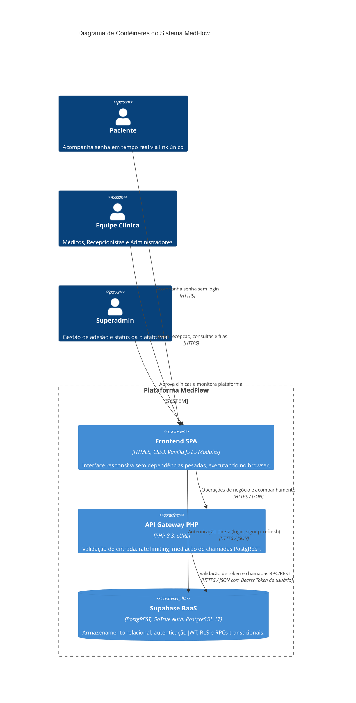
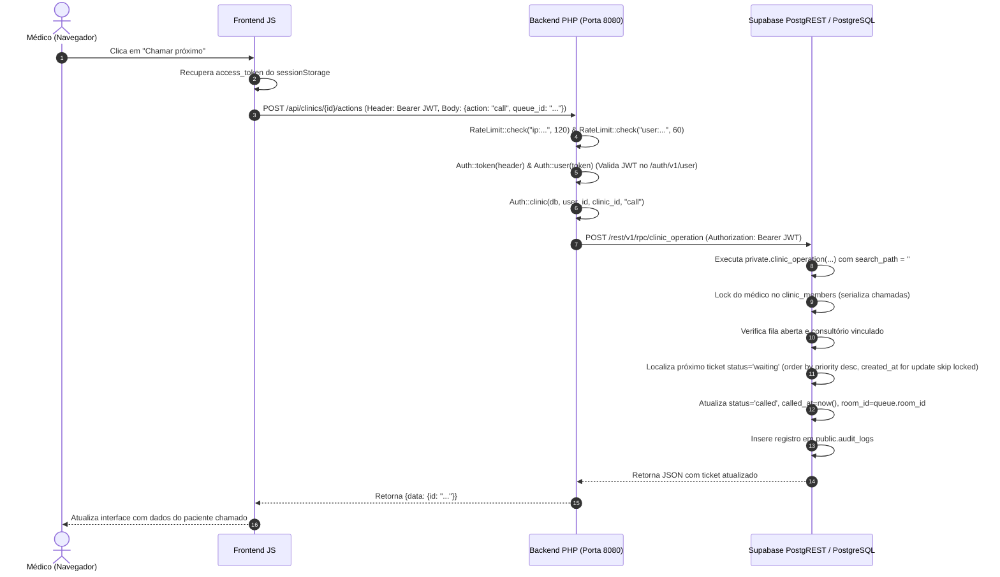
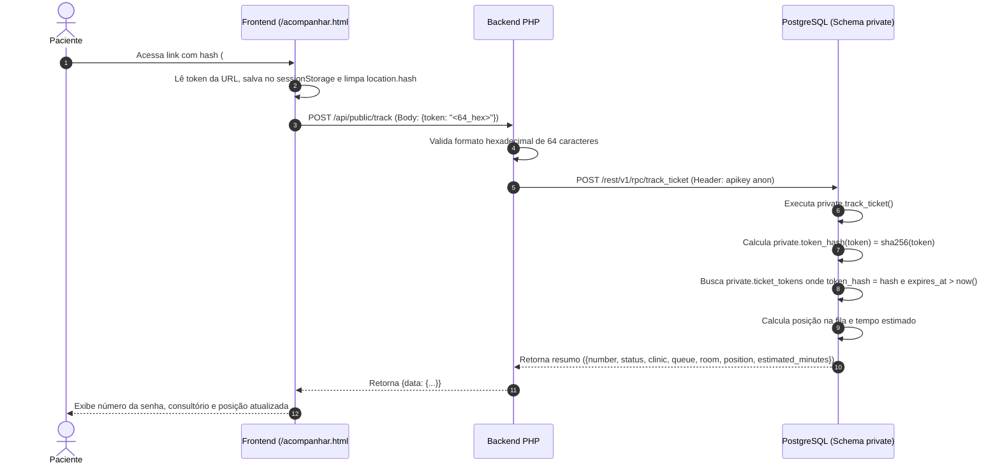

# Arquitetura do Sistema — MedFlow

Este documento descreve detalhadamente as decisões de arquitetura, padrões estruturais, modelo de dados multi-tenant, ciclo de vida das requisições e a infraestrutura de segurança do **MedFlow**.

---

## 1. Princípios Arquiteturais

1. **Privacidade por Desenho (*Privacy by Design*):**
   - Ausência intencional de dados de prontuário, diagnósticos clínicos e identificadores fiscais (como CPF).
   - O paciente não expõe seu nome em telas públicas ou links de acompanhamento.
2. **Defesa em Profundidade (*Defense in Depth*):**
   - A autorização é checada em múltiplas camadas: no gateway PHP 8.3 e no banco de dados via Row Level Security (RLS) e Stored Procedures (RPC).
   - A seleção do cabeçalho ou payload com `clinic_id` nunca é suficiente para provar permissão; a identidade é extraída do JWT verificado e validada contra tabelas de filiação com clínicas ativas.
3. **Mínimo Privilégio Absoluto (Zero `service_role`):**
   - O backend PHP **não utiliza nem possui a chave mestra `service_role`** do Supabase.
   - O backend se comunica com o PostgREST usando a chave pública (`publishableKey`) e repassa o Bearer Token do próprio usuário autenticado.
   - Nenhuma vulnerabilidade de código no PHP pode conceder bypass de RLS ou acesso indiscriminado a dados de todas as clínicas.
4. **Isolamento Estrito entre Tenants (*Multi-Tenancy*):**
   - Todas as tabelas operacionais possuem `clinic_id` e usam chaves estrangeiras compostas `(clinic_id, id)` para impedir vazamento cruzado entre clínicas.
   - Um superadministrador gerencia o ciclo de vida das clínicas, mas suas permissões RLS o impedem de ler listas de pacientes ou filas médicas.

---

## 2. Visão Geral da Arquitetura (Diagrama C4 de Contêineres)



---

## 3. Componentes do Sistema

### 3.1. Frontend (SPA Vanilla Moderna)
- **Localização:** `/frontend`
- **Tecnologias:** HTML5 semântico, Vanilla CSS customizado (sem Tailwind ou frameworks de terceiros), JavaScript ES Modules nativo.
- **Segurança no Cliente:**
  - Content Security Policy (CSP) estrito configurado em `frontend/vercel.json`.
  - Manipulação do DOM exclusivamente via `textContent`, `replaceChildren()` e nós nativos, evitando qualquer injeção via `innerHTML`.
  - Tokens de autenticação armazenados em `sessionStorage` (com renovação de refresh token automática 60 segundos antes da expiração).
  - Remoção imediata de tokens da URL após leitura (`history.replaceState`), prevenindo vazamento de tokens em histórico do navegador ou headers *Referer*.

### 3.2. Backend (API Gateway em PHP 8.3)
- **Localização:** `/backend`
- **Padrão:** Front Controller (`backend/public/index.php`) com injeção de dependência e repositórios.
- **Responsabilidades:**
  - **CORS Estrito:** Validação rígida da origem (`FRONTEND_ORIGIN`). Origens não correspondentes recebem HTTP 403 imediato.
  - **Rate Limiting Local:** Implementado via arquivo e lock exclusivo (`flock`) em diretório isolado (`RATE_LIMIT_DIR`). Limita 120 req/min por IP e 60 req/min por usuário autenticado.
  - **Validação e Sanitização de Payload:** Inspeção rigorosa de tipos, tamanhos de strings e ausência de caracteres de controle invisíveis (`\x00-\x1F\x7F`).
  - **Geração Segura de Tokens:** Geração de segredos criptográficos via `random_bytes(32)` para links de convites e links de acompanhamento de senhas.
  - **Repasse de Credenciais (*Credential Forwarding*):** Encaminha a chamada para o PostgREST com o JWT do cliente, assegurando que o PostgreSQL identifique exatamente o usuário que efetuou a requisição.

### 3.3. Banco de Dados & Camada de Serviços (PostgreSQL 17 / Supabase)
- **Localização:** `/supabase/migrations`
- **Divisão de Schemas:**
  - **`public`**: Contém tabelas expostas pelo PostgREST, todas com Row Level Security (RLS) obrigatório habilitado. Contém funções públicas do tipo `SECURITY INVOKER` que agem como interfaces seguras da API REST.
  - **`private`**: Schema inacessível diretamente via REST (`revoke all on schema private from public`). Contém tabelas de alta sensibilidade (ex: `staff_invites` e `ticket_tokens`) e funções transacionais `SECURITY DEFINER` com `search_path = ''`.
  - **`auth`**: Gerenciado pelo Supabase GoTrue para dados de usuários (`auth.users`) e tokens JWT.

---

## 4. Ciclo de Vida da Requisição (*Request Lifecycle*)

### 4.1. Fluxo Autenticado Operacional (Exemplo: Médico Chama Próximo Paciente)



### 4.2. Fluxo Público de Acompanhamento (Paciente Sem Conta)



---

## 5. Padrão de Isolamento Multi-Tenant

Para garantir que dados de uma clínica jamais vazem para outra clínica:

1. **Foreign Keys Compostas:**
   As tabelas que se relacionam internamente em uma clínica possuem restrições `UNIQUE(clinic_id, id)` e as chaves estrangeiras vinculam tanto a chave primária quanto o `clinic_id`.
   ```sql
   foreign key (clinic_id, queue_id) references public.queues(clinic_id, id)
   foreign key (clinic_id, patient_id) references public.patients(clinic_id, id)
   foreign key (clinic_id, room_id) references public.rooms(clinic_id, id)
   ```
   Isso impossibilita referenciar uma fila ou paciente de outra clínica, mesmo por manipulação de payload.

2. **Função Central de Autorização:**
   A função `private.has_clinic_role(p_clinic uuid, p_roles text[])` é a base das políticas RLS e das RPCs. Ela valida se o usuário autenticado (`auth.uid()`) é membro da clínica especificada, se o vínculo está `active = true` e se a clínica está com status `active`.

---

## 6. Tratamento de Concorrência e Travas de Linha (*Row Locking*)

O MedFlow trata com rigor cenários de concorrência simultânea extrema (testados com sucesso em testes multithread automatizados):

| Cenário Concorrente | Mecanismo de Prevenção | Resultado |
|---|---|---|
| **Múltiplos check-ins para o mesmo paciente** | Índice único condicional `one_active_ticket_per_patient` onde `status in ('waiting','called','in_service')`. | Bloqueio imediato com erro de violação de unicidade. |
| **Geração simultânea de número de senha** | Linha da fila bloqueada com `for update` durante o check-in. | Numeração sequencial contínua garantida (1, 2, 3...). |
| **Múltiplos médicos chamando a mesma fila** | `order by priority desc, created_at, id limit 1 for update skip locked`. | Cada médico obtém uma senha distinta; nenhuma senha é atribuída em duplicidade. |
| **Médico chamando novo paciente antes de finalizar o anterior** | Trava na linha do médico em `clinic_members for update` e índice único `one_active_appointment_per_doctor`. | Erro `Finish current ticket first` até que o atendimento anterior seja concluído ou cancelado. |
| **Desativação do último administrador da clínica** | Trava na tabela `clinics for update` e contagem atômica de administradores ativos restantes. | Erro `Last administrator` impedindo que a clínica fique sem gestão. |
| **Fechamento de fila com pacientes aguardando** | Bloqueio com `for update` na fila e validação de tickets ativos antes de alterar status para `closed`. | Erro `Queue has active tickets`. |
