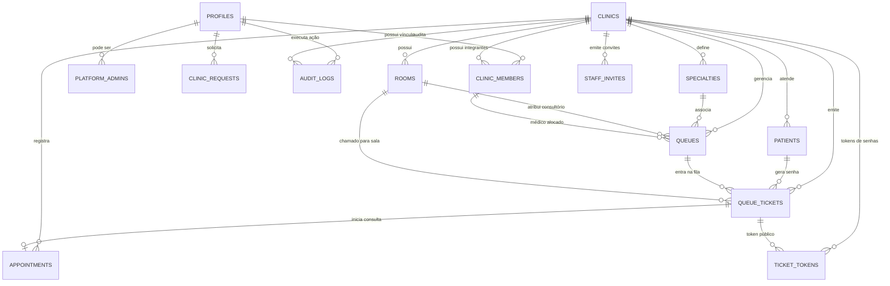

# Banco de Dados & Dicionário de Dados — MedFlow

Este documento documenta integralmente a estrutura de banco de dados do **MedFlow**, construída em **PostgreSQL 17** sobre o ecossistema Supabase.

---

## 1. Diagrama Entidade-Relacionamento (ERD)

---

## 2. Estrutura de Schemas

O MedFlow divide estritamente o banco em três schemas:

1. **`auth` (Supabase GoTrue):**
   - Gerencia credenciais criptografadas, confirmação de e-mail e emissão de JWT.
   - Nenhuma tabela de negócio é criada dentro de `auth`.
2. **`public` (PostgREST / API Exposta):**
   - Contém todas as tabelas acessíveis para leitura por usuários autorizados via RLS.
   - Contém funções públicas `SECURITY INVOKER`, que servem como contrato de interface para chamadas RPC do PostgREST.
3. **`private` (Schema Interno e Privado):**
   - **Acesso direto revogado:** `revoke all on schema private from public; revoke all on private.staff_invites, private.ticket_tokens from public, anon, authenticated;`.
   - Contém tabelas sensíveis de segurança (hashes de convites e senhas).
   - Contém as implementações reais de funções `SECURITY DEFINER` com `set search_path = ''`.

---

## 3. Dicionário de Tabelas (`public`)

### 3.1. `public.profiles`
Armazena dados cadastrais públicos vinculados a uma conta de usuário do Supabase.
- **Chave Primária:** `id` (`uuid references auth.users(id) on delete cascade`)
- **Colunas:**
  - `display_name text not null default '' check(length(display_name) <= 120)`: Nome de exibição do usuário.
  - `created_at timestamptz not null default now()`: Data/hora do registro.
- **Trigger:** Alimentada automaticamente pelo trigger `auth_profile` ao registrar novo usuário em `auth.users`.

### 3.2. `public.platform_admins`
Define as contas com privilégios de superadministrador da plataforma MedFlow.
- **Chave Primária:** `user_id` (`uuid references auth.users(id)`)
- **Colunas:**
  - `created_at timestamptz not null default now()`
- **Regra de Segurança:** Não permite autopromoção pública. Concedida apenas via SQL controlado por operador autorizado.

### 3.3. `public.clinics`
Registra as clínicas médicas cadastradas na plataforma.
- **Chave Primária:** `id` (`uuid default gen_random_uuid()`)
- **Colunas:**
  - `name text not null check(length(trim(name)) between 3 and 120)`: Razão social ou nome fantasia.
  - `status text not null default 'active' check(status in ('pending','active','rejected','suspended'))`: Estado operacional da clínica.
  - `timezone text not null default 'America/Sao_Paulo'`: Fuso horário oficial para contagem diária de senhas.
  - `contact_email text`: E-mail oficial de contato.
  - `city text`: Cidade sede.
  - `created_at timestamptz not null default now()`

### 3.4. `public.clinic_requests`
Solicitações de abertura de clínica enviadas por proprietários.
- **Chave Primária:** `id` (`uuid default gen_random_uuid()`)
- **Colunas:**
  - `owner_id uuid not null references auth.users(id)`: Usuário solicitante.
  - `name text not null check(length(trim(name)) between 3 and 120)`: Nome pretendido.
  - `contact_email text not null check(length(contact_email) <= 254 and contact_email ~ '^[^ @]+@[^ @]+\.[^ @]+$')`: E-mail de contato válido.
  - `city text not null check(length(trim(city)) between 2 and 120)`: Cidade.
  - `status text not null default 'pending' check(status in ('pending','active','rejected'))`
  - `clinic_id uuid references public.clinics(id)`: ID da clínica criada caso aprovada.
  - `reason text`: Justificativa obrigatória em caso de rejeição (5 a 500 caracteres).
  - `decided_by uuid references auth.users(id)`: Superadministrador que tomou a decisão.
  - `decided_at timestamptz`: Momento da decisão.
  - `created_at timestamptz not null default now()`
- **Restrição de Integridade:** Garante consistência mútua entre status, campos de decisão e vínculo de clínica.
- **Índice Único Parcial:** `one_pending_request on (owner_id) where status = 'pending'` (impede flood de solicitações pendentes por proprietário).

### 3.5. `public.clinic_members`
Vínculos e permissões de usuários dentro de cada clínica (*RBAC*).
- **Chave Primária Composta:** `(clinic_id, user_id)`
- **Colunas:**
  - `clinic_id uuid not null references public.clinics(id)`
  - `user_id uuid not null references auth.users(id)`
  - `role text not null check(role in ('admin','doctor','receptionist','patient'))`
  - `active boolean not null default true`: Situação do vínculo (ativo ou suspenso).
  - `created_at timestamptz not null default now()`
- **Índice:** `members_user_clinic on (user_id, clinic_id)`

### 3.6. `public.specialties`
Especialidades médicas disponíveis na clínica (ex: Cardiologia, Pediatria, Ortopedia).
- **Chave Primária:** `id` (`uuid default gen_random_uuid()`)
- **Colunas:**
  - `clinic_id uuid not null references public.clinics(id)`
  - `name text not null`: Nome da especialidade.
  - `created_at timestamptz not null default now()`
- **Constraints Únicas Compostas:** `unique(clinic_id, id)` e `unique(clinic_id, name)`.

### 3.7. `public.rooms`
Consultórios físicos e salas de atendimento da clínica (ex: Consultório 01, Sala de Triagem).
- **Chave Primária:** `id` (`uuid default gen_random_uuid()`)
- **Colunas:**
  - `clinic_id uuid not null references public.clinics(id)`
  - `name text not null`: Nome ou número da sala.
  - `created_at timestamptz not null default now()`
- **Constraints Únicas Compostas:** `unique(clinic_id, id)` e `unique(clinic_id, name)`.

### 3.8. `public.queues`
Filas de atendimento ativas ou configuradas.
- **Chave Primária:** `id` (`uuid default gen_random_uuid()`)
- **Colunas:**
  - `clinic_id uuid not null references public.clinics(id)`
  - `name text not null default 'Fila de atendimento'`: Nome identificador da fila.
  - `specialty_id uuid not null`: Especialidade associada.
  - `doctor_id uuid`: Médico responsável pela chamada.
  - `room_id uuid`: Consultório padrão da fila.
  - `expected_minutes integer not null default 15 check(expected_minutes between 1 and 240)`: Tempo médio estimado por consulta.
  - `status text not null default 'open' check(status in ('open','closed'))`
  - `created_at timestamptz not null default now()`
- **Foreign Keys Compostas:**
  - `(clinic_id, specialty_id) references public.specialties(clinic_id, id)`
  - `(clinic_id, doctor_id) references public.clinic_members(clinic_id, user_id)`
  - `(clinic_id, room_id) references public.rooms(clinic_id, id)`

### 3.9. `public.patients`
Cadastro de pacientes atendidos pela clínica.
- **Chave Primária:** `id` (`uuid default gen_random_uuid()`)
- **Colunas:**
  - `clinic_id uuid not null references public.clinics(id)`
  - `user_id uuid references auth.users(id)`: Vínculo opcional com conta confirmada de paciente.
  - `name text not null check(length(name) between 2 and 120)`: Nome do paciente.
  - `created_at timestamptz not null default now()`
- **Privacidade Operacional:** Não armazena CPF, telefone ou prontuário médico.

### 3.10. `public.queue_tickets`
Senhas de atendimento geradas diariamente.
- **Chave Primária:** `id` (`uuid default gen_random_uuid()`)
- **Colunas:**
  - `clinic_id uuid not null references public.clinics(id)`
  - `queue_id uuid not null`
  - `patient_id uuid not null`
  - `room_id uuid`: Consultório para onde o paciente foi chamado.
  - `number integer not null check(number > 0)`: Número sequencial do dia (001, 002...).
  - `ticket_date date not null default current_date`: Data operacional da clínica.
  - `priority boolean not null default false`: Marcação de atendimento prioritário (idosos, PCDs, gestantes, etc.).
  - `status text not null default 'waiting' check(status in ('waiting','called','in_service','completed','absent','cancelled'))`
  - `created_at timestamptz not null default now()`
  - `called_at timestamptz`: Momento em que o médico acionou a chamada.
- **Constraints Únicas Compostas:**
  - `unique(clinic_id, id)`
  - `unique(clinic_id, queue_id, ticket_date, number)` (garante numeração sequencial sem duplicidade por fila/dia).
- **Índice Único Parcial:** `one_active_ticket_per_patient on (clinic_id, patient_id) where status in ('waiting','called','in_service')` (impede emissão de mais de uma senha ativa para o mesmo paciente).
- **Índice de Ordenação de Fila:** `queue_waiting_order on (clinic_id, queue_id, priority desc, created_at, id) where status = 'waiting'`.

### 3.11. `public.appointments`
Registros de consultas em andamento e finalizadas.
- **Chave Primária:** `id` (`uuid default gen_random_uuid()`)
- **Colunas:**
  - `clinic_id uuid not null references public.clinics(id)`
  - `ticket_id uuid not null`: Senha correspondente.
  - `doctor_id uuid not null`: Médico que realizou o atendimento.
  - `started_at timestamptz not null default now()`
  - `ended_at timestamptz`: Momento de conclusão.
  - `status text not null default 'in_service' check(status in ('in_service','completed'))`
- **Índice Único Parcial:** `one_active_appointment_per_doctor on (clinic_id, doctor_id) where status = 'in_service'` (garante que um médico jamais mantenha dois atendimentos simultâneos).

### 3.12. `public.audit_logs`
Trilha de auditoria indelével de todas as ações administrativas e clínicas.
- **Chave Primária:** `id` (`uuid default gen_random_uuid()`)
- **Colunas:**
  - `clinic_id uuid references public.clinics(id)` (nulo para eventos de plataforma)
  - `actor_id uuid not null references auth.users(id)`: Usuário que disparou a ação.
  - `action text not null`: Identificador da ação (ex: `clinic.call`, `clinic.checkin`, `clinic_request.approve`).
  - `target_id uuid not null`: Registro alvo afetado.
  - `metadata jsonb not null default '{}'`: Metadados adicionais.
  - `created_at timestamptz not null default now()`

---

## 4. Dicionário de Tabelas Privadas (`private`)

### 4.1. `private.staff_invites`
Armazena convites para novos integrantes da equipe clínica.
- **Chave Primária:** `id` (`uuid default gen_random_uuid()`)
- **Colunas:**
  - `clinic_id uuid not null references public.clinics(id)`
  - `email text not null`: E-mail autorizado para resgatar o convite.
  - `role text not null check(role in ('admin','doctor','receptionist','patient'))`
  - `token_hash text not null unique`: Hash SHA-256 do segredo de 32 bytes entregue ao destinatário.
  - `created_by uuid not null references auth.users(id)`
  - `created_at timestamptz not null default now()`
  - `expires_at timestamptz not null default now() + interval '7 days'`
  - `accepted_at timestamptz`
  - `revoked_at timestamptz`
- **Proteção RLS:** Política explícita `deny_direct_invite_access for all to anon, authenticated using (false) with check (false)`.

### 4.2. `private.ticket_tokens`
Tokens para acompanhamento público individual de senhas pelo paciente.
- **Chave Primária:** `token_hash` (`text`) - Hash SHA-256 do segredo de 32 bytes entregue ao paciente.
- **Colunas:**
  - `clinic_id uuid not null`
  - `ticket_id uuid not null`
  - `expires_at timestamptz not null default now() + interval '48 hours'`
- **Proteção RLS:** Política explícita `deny_direct_tracking_access for all to anon, authenticated using (false) with check (false)`.

---

## 5. Políticas de Segurança em Nível de Linha (*Row Level Security — RLS*)

Todas as tabelas possuem RLS habilitado (`alter table ... enable row level security;`). Acesso anônimo a tabelas públicas é revogado.

| Tabela | Política | Acesso | Condição / Expressão SQL |
|---|---|---|---|
| `profiles` | `own_profile` | SELECT | `id = auth.uid()` |
| `platform_admins` | `own_platform_role` | SELECT | `user_id = auth.uid()` |
| `clinics` | `clinic_visibility` | SELECT | `private.is_platform_admin() OR private.has_clinic_role(id, array['admin','doctor','receptionist','patient'])` |
| `clinic_requests` | `request_visibility` | SELECT | `owner_id = auth.uid() OR private.is_platform_admin()` |
| `clinic_members` | `membership_visibility` | SELECT | `user_id = auth.uid() OR private.has_clinic_role(clinic_id, array['admin'])` |
| `patients` | `patient_visibility` | SELECT | `private.can_read_patient(clinic_id, id)` |
| `specialties` | `specialty_visibility` | SELECT | `private.has_clinic_role(clinic_id, array['admin','doctor','receptionist'])` |
| `rooms` | `room_visibility` | SELECT | `private.has_clinic_role(clinic_id, array['admin','doctor','receptionist'])` |
| `queues` | `queue_visibility` | SELECT | `private.has_clinic_role(clinic_id, array['admin','receptionist']) OR (doctor_id = auth.uid() AND private.has_clinic_role(clinic_id, array['doctor']))` |
| `queue_tickets` | `ticket_visibility` | SELECT | `private.has_clinic_role(clinic_id, array['admin','receptionist']) OR (private.has_clinic_role(clinic_id, array['doctor']) AND exists(... fila atribuída ao médico))` |
| `appointments` | `appointment_visibility` | SELECT | `private.has_clinic_role(clinic_id, array['admin']) OR (doctor_id = auth.uid() AND private.has_clinic_role(clinic_id, array['doctor']))` |
| `audit_logs` | `audit_visibility` | SELECT | `(clinic_id is null AND private.is_platform_admin()) OR (clinic_id is not null AND private.has_clinic_role(clinic_id, array['admin']))` |

---

## 6. Procedimentos Armazenados e RPCs

### 6.1. Funções Auxiliares de Segurança (`private`)
- `private.is_platform_admin() returns boolean`: Verifica se o usuário atual autenticado está presente em `public.platform_admins`, possui e-mail confirmado e não é anônimo.
- `private.has_clinic_role(p_clinic uuid, p_roles text[]) returns boolean`: Verifica se o usuário autenticado possui vínculo ativo com a clínica informada para as funções fornecidas e se a clínica está com `status = 'active'`.
- `private.token_hash(p_token text) returns text`: Calcula `encode(sha256(convert_to(p_token, 'UTF8')), 'hex')`.
- `private.can_read_patient(p_clinic uuid, p_patient uuid) returns boolean`: Regra fina para leitura de pacientes. Médicos só leem pacientes que estão em suas próprias filas; recepcionistas e administradores leem todos da clínica; pacientes só leem o próprio registro.

### 6.2. Funções Transacionais de Negócio
- `public.submit_clinic_request(p_name, p_contact_email, p_city) returns uuid`:
  Submete nova clínica para análise. Exige e-mail confirmado e usuário não anônimo. Gera auditoria `clinic_request.submitted`.
- `public.decide_clinic_request(p_request_id, p_decision, p_reason) returns uuid`:
  Exige privilégio de superadministrador. Em caso de aprovação (`approve`), cria atômica e simultaneamente o registro da clínica em `public.clinics` e o vínculo de `admin` em `public.clinic_members`.
- `public.platform_clinic_status(p_clinic, p_status, p_reason) returns uuid`:
  Permite ao superadministrador suspender ou reativar uma clínica, gravando justificativa obrigatória no log de auditoria.
- `public.accept_staff_invite(p_token) returns uuid`:
  Permite ao convidado aceitar o vínculo. Valida o hash do token contra `private.staff_invites`, confere se o e-mail da conta coincide com o e-mail convidado, verifica se o administrador criador continua ativo e insere em `public.clinic_members`.
- `public.clinic_operation(p_clinic, p_action, p_data) returns jsonb`:
  Motor de execução atômica de operações clínicas:
  - `settings`: Atualiza nome, timezone, contato e cidade da clínica.
  - `specialty` / `specialty_edit`: Cadastra ou edita especialidades.
  - `room` / `room_edit`: Cadastra ou edita salas e consultórios.
  - `queue` / `queue_edit` / `queue_status`: Configura filas e altera estado aberto/fechado.
  - `invite` / `revoke_invite`: Emite e cancela convites para a equipe.
  - `member`: Altera papéis ou ativação de integrantes (bloqueando remoção do último administrador).
  - `patient` / `patient_edit`: Cadastra pacientes e vincula conta de e-mail opcional.
  - `checkin`: Emite nova senha diária sequencial e vincula token SHA-256 de 48h.
  - `cancel`: Cancela senha aguardando ou chamada.
  - `tracking`: Rotaciona o token da senha (invalidando o link anterior).
  - `call`: Serializa a chamada do médico para a próxima senha da fila (`skip locked`).
  - `start`: Transforma a senha em consulta em andamento e cria registro em `appointments`.
  - `finish`: Conclui a consulta e a senha associada.
  - `absent`: Registra não comparecimento do paciente.
- `public.clinic_workspace(p_clinic) returns jsonb`:
  Agrega o estado operacional completo da clínica de acordo com o papel do usuário (médico, recepcionista, admin ou paciente).
- `public.track_ticket(p_token) returns jsonb`:
  Retorna o resumo público da senha a partir do token de 64 hexadecimais, sem expor nomes de outros pacientes.
