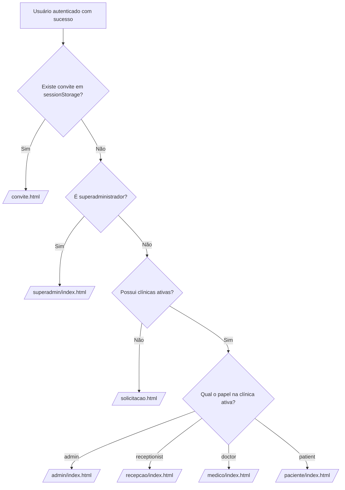

# Frontend & Experiência do Usuário — MedFlow

Este documento descreve detalhadamente a arquitetura, design system, fluxo de telas e comportamento interativo da interface do **MedFlow**.

---

## 1. Filosofia de Engenharia do Frontend

O frontend do MedFlow foi construído seguindo diretrizes de **alta performance, máxima segurança e zero dependência de bibliotecas externas**:
- **Vanilla JavaScript Moderno (ES Modules):** Sem dependência de bundlers obrigatórios, Webpack ou Node em tempo de execução para servir arquivos estáticos.
- **Vanilla CSS com Design System Consistente:** Paleta de cores baseada em tokens HSL/Hex refinados (tons de azul clínico `#1e3a8a`, `#2563eb`, cinzas neutros `#f8fafc`, `#e2e8f0` e estados semânticos de erro e sucesso), tipografia moderna e layouts totalmente responsivos com CSS Grid e Flexbox.
- **Proteção Integral Contra Cross-Site Scripting (DOM XSS):**
  - **Uso Estrito de APIs Seguras:** O código **não utiliza `innerHTML`** em nenhuma tela. Todos os nós HTML dinâmicos são criados via `document.createElement()`, e dados textuais inseridos via `textContent`.
  - **Limpeza de Fragments na URL:** Ao ler tokens presentes no hash da URL (`/acompanhar.html#<token>` ou `/convite.html#<token>`), o hash é imediatamente consumido, gravado no `sessionStorage` e removido da barra de endereços com `history.replaceState()`, impedindo vazamentos em históricos e cabeçalhos *Referer*.
- **Content Security Policy (CSP):**
  Definido em `frontend/vercel.json`, restringindo origens permitidas de scripts, conexões de API e estilos:
  ```json
  "Content-Security-Policy": "default-src 'self'; script-src 'self'; style-src 'self'; connect-src 'self' https://*.supabase.co http://localhost:8080 http://127.0.0.1:8080; frame-ancestors 'none'; base-uri 'self'; form-action 'self'"
  ```

---

## 2. Estrutura de Arquivos do Frontend

```
frontend/
├── assets/                 # Imagens e recursos visuais
├── css/
│   └── style.css           # Design system completo e estilos responsivos
├── js/
│   ├── config.example.js   # Modelo público de configuração
│   ├── config.js           # Configurações ativas da instância (URL Supabase e API)
│   ├── auth.js             # Módulo de autenticação com Supabase GoTrue
│   ├── api.js              # Cliente HTTP para comunicação com a API PHP
│   ├── navigation.js       # Roteamento baseado em papéis e persistência de clínica
│   ├── operations.js       # Motor das operações clínicas (tabelas, ações, modais)
│   ├── app.js              # Controladores das telas de autenticação e plataforma
│   └── bootstrap.js        # Script de inicialização importado pelas páginas
├── admin/
│   └── index.html          # Espaço de trabalho do Administrador da Clínica
├── recepcao/
│   └── index.html          # Espaço de trabalho da Recepção
├── medico/
│   └── index.html          # Espaço de trabalho do Médico
├── paciente/
│   └── index.html          # Espaço de trabalho do Paciente
├── superadmin/
│   └── index.html          # Painel de Controle da Plataforma
├── acompanhar.html         # Página pública de acompanhamento da senha
├── cadastro.html           # Cadastro de nova conta
├── convite.html            # Aceite de convite da equipe
├── index.html              # Página inicial institucional (Landing Page)
├── login.html              # Login na plataforma
├── recuperar.html          # Recuperação e redefinição de senha
├── solicitacao.html        # Solicitação de abertura de clínica
└── vercel.json             # Headers HTTP e regras de publicação na Vercel
```

---

## 3. Gerenciamento de Autenticação e Sessão (`auth.js`)

O módulo `auth.js` comunica-se diretamente com o serviço GoTrue do Supabase (`https://<project>.supabase.co/auth/v1/`):
- **Armazenamento de Sessão:** Chave `medflow.session` no `sessionStorage` do navegador contendo `access_token`, `refresh_token`, `expires_in` e `expires_at`.
- **Renovação Automática de Token (*Token Refresh*):**
  A função `accessToken()` verifica se a expiração ocorrerá em menos de 60 segundos (`expires_at < Date.now()/1000 + 60`). Caso afirmativo, dispara silenciosamente a renovação de credenciais via `grant_type=refresh_token`.
- **Validação de E-mail Obrigatória:**
  Tentativas de login com contas cujo e-mail ainda não foi confirmado são interceptadas, exibindo mensagem amigável e orientando o usuário a checar a caixa de entrada.
- **Tratamento de Callback de E-mail:**
  Ao clicar em links de confirmação de e-mail ou redefinição de senha enviados pelo Supabase, o método `callback()` processa o hash, inicializa a sessão e redireciona o usuário para o fluxo correto.

---

## 4. Roteamento Inteligente por Papel (`navigation.js`)

Ao concluir o login, a função `homeFor(me)` avalia as permissões do usuário e o redireciona automaticamente:



---

## 5. Mecanismo de Polling e Notificações Web

Nas telas operacionais e de acompanhamento de senha:
1. **Intervalo de Polling:** Atualização silenciosa a cada **10 segundos** via `setInterval`.
2. **Economia de Recursos & Prevenção de Conflitos:**
   - O polling é suspenso se a aba estiver oculta ou minimizada (`document.hidden`).
   - O polling é suspenso durante a submissão de formulários ou confirmação de caixas de diálogo para evitar sobreposição de estados.
3. **Web Notifications API:**
   - Na página `/acompanhar.html`, o paciente pode clicar em **"Ativar alertas de chamada"**.
   - Quando o status da senha transita de `waiting` para `called`, o navegador dispara uma notificação do sistema operacional com som e vibração informando o número da senha e o consultório de destino.

---

## 6. Guia Visual das Telas e Fluxos

### 6.1. Página Institucional (`/index.html`)
Apresentação do sistema com acesso direto para cadastro de novas clínicas, login, acompanhamento de senhas por código e resgate de convites.

### 6.2. Autenticação e Cadastro (`/login.html`, `/cadastro.html`, `/recuperar.html`)
- **Cadastro:** Exige nome, e-mail e senha de no mínimo 12 caracteres.
- **Recuperação:** Fluxo em duas etapas: solicitação do link por e-mail e redefinição da nova senha na mesma interface.

### 6.3. Solicitação de Clínica (`/solicitacao.html`)
Exibida para proprietários de clínicas recém-cadastrados. Permite enviar nome, e-mail e cidade da clínica e acompanhar a situação do pedido (Em análise, Aprovada ou Rejeitada com motivo).

### 6.4. Painel do Superadministrador (`/superadmin/index.html`)
- Métricas consolidadas de solicitações pendentes e clínicas ativas.
- Tabela de aprovação e rejeição com modal de justificativa obrigatória em caso de recusa.
- Suspensão e reativação de clínicas com registro em log de auditoria.

### 6.5. Painel do Administrador da Clínica (`/admin/index.html`)
Contém abas operacionais dinâmicas:
1. **Visão Geral:** Contadores em tempo real de pacientes aguardando, chamados e em atendimento; tabela de fila ativa e histórico das últimas 48 horas.
2. **Recepção:** Formulários para cadastrar pacientes e emitir senhas.
3. **Equipe e Convites:** Emissão de convites por e-mail com geração de link individual, listagem de integrantes com ativação/desativação e troca de função.
4. **Clínica e Filas:** Edição de dados da clínica, criação de especialidades, consultórios e filas com duração média esperada.
5. **Relatórios:** Estatísticas dos últimos 30 dias (total de senhas, finalizadas, ausências, tempo médio de espera e atendimento) e botão para **Exportar resumo em CSV**.

### 6.6. Painel da Recepção (`/recepcao/index.html`)
Focado na agilidade de atendimento:
- Cadastro rápido de pacientes (com busca nos até 500 mais recentes).
- Registro de chegada (*check-in*): seleção do paciente, fila aberta e marcação de prioridade legal.
- Emissão imediata do link de acompanhamento com diálogo acessível para cópia com um clique ou abertura em nova janela.
- Cancelamento e regeneração de links de senhas.

### 6.7. Painel do Médico (`/medico/index.html`)
Interface focada e sem distrações para o consultório:
- Seleção da fila do médico.
- Botão proeminente **"Chamar próximo"**: respeita prioridades legais e ordem cronológica.
- Botões de fluxo da consulta: **"Iniciar"**, **"Finalizar"** ou registrar **"Ausente"**.
- Bloqueio automático que impede chamar múltiplos pacientes simultaneamente.

### 6.8. Acompanhamento do Paciente (`/acompanhar.html`)
Página responsiva otimizada para smartphones:
- Exibe número grande da senha (ex: `014`).
- Posição atual na fila e tempo estimado em minutos.
- Mudança de cor e destaque visual quando o paciente é chamado para o consultório.
- Atualização em tempo real sem exigir que o paciente fique recarregando a página manualmente.
