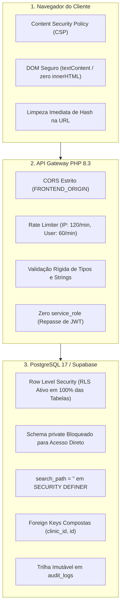

# Segurança, Privacidade & Conformidade — MedFlow

Este documento descreve detalhadamente o modelo de ameaças, os mecanismos de proteção criptográfica, as políticas de segurança da informação e as diretrizes de conformidade com a **Lei Geral de Proteção de Dados (LGPD - Lei 13.709/2018)** implementadas no **MedFlow**.

---

## 1. Princípios e Modelo de Ameaças

O MedFlow opera em um setor crítico (gestão em saúde) onde a confidencialidade e a integridade de dados são imperativas. O sistema adota uma postura de segurança defensiva com foco em **mínimo privilégio**, **superfície de ataque reduzida** e **isolamento rígido de dados**.

### Matriz de Ameaças & Mitigações:

| Vetor de Ataque | Risco Potencial | Mitigação Implementada no MedFlow |
|---|---|---|
| **Vazamento de Segredo de Servidor** | Comprometimento total de todos os tenants se a chave mestra for roubada. | **Eliminação da chave `service_role`:** O backend PHP **não possui** e não armazena chaves com privilégios de bypass. Toda chamada utiliza a chave pública anônima e o Bearer Token do próprio usuário. |
| **Quebra de Isolamento Multi-Tenant (*BOLA / IDOR*)** | Um usuário de uma clínica acessar pacientes ou filas de outra clínica. | 1. Foreign keys compostas `(clinic_id, id)` em todas as tabelas operacionais. 2. Verificação obrigatória de filiação ativa via RLS e na camada PHP. 3. RPCs transacionais que validam o papel antes de qualquer mutação. |
| **Injeção de Search Path em Stored Procedures** | Atacante engana funções `SECURITY DEFINER` manipulando a resolução de esquemas. | Todas as funções `SECURITY DEFINER` possuem `SET search_path = ''` e referenciam esquemas explicitamente (`public.` e `private.`). |
| **Enumeração ou Força Bruta de Senhas e Links** | Terceiros tentarem adivinhar senhas de pacientes ou links de convite. | Tokens gerados com **32 bytes de entropia criptográfica** (`random_bytes(32)` = 64 hexadecimais, espaço de $2^{256}$ combinações) e armazenados **exclusivamente como hash SHA-256** unidirecional em schema privado com bloqueio total de leitura direta via RLS. |
| **Denegação de Serviço / Flood de Requisições** | Esgotamento de recursos por requisições em massa. | Rate Limiter com lock exclusivo de arquivo (`flock`), limitando 120 req/min por IP e 60 req/min por usuário autenticado. |
| **Cross-Site Scripting (DOM XSS)** | Execução de scripts maliciosos no navegador do operador. | 1. O frontend não utiliza `innerHTML` em nenhum trecho de código. 2. Manipulação via nós nativos e `textContent`. 3. Content Security Policy (CSP) restritivo. |
| **Manipulação de Cabeçalhos de Proxy** | Spoofing de IP para contornar o rate limit. | Não há confiança cega em `X-Forwarded-For`. A restrição avalia primariamente o socket direto (`REMOTE_ADDR`) e o identificador do usuário autenticado (`user_id`). |

---

## 2. Camadas de Defesa em Profundidade

---

## 3. Gestão Criptográfica de Tokens & Convites

### 3.1. Convites de Equipe (`staff_invites`)
- **Geração:** O administrador da clínica gera um convite informando o e-mail da pessoa e a função pretendida. A API gera um segredo de 32 bytes criptograficamente aleatório via `random_bytes(32)`.
- **Armazenamento:** O banco calcula `sha256(token)` e armazena **apenas o hash** na tabela `private.staff_invites`.
- **Expiração:** Validade padrão de **7 dias**.
- **Validação no Aceite:**
  1. O usuário que resgata o convite deve estar autenticado com uma conta no Supabase.
  2. O e-mail da conta do usuário autenticado deve corresponder exatamente ao e-mail informado no convite.
  3. O administrador que criou o convite precisa continuar com vínculo ativo e papel de administrador na clínica.
  4. Uma vez aceito, a data `accepted_at` é preenchida e o token é invalidado para reuso.

### 3.2. Senhas e Links de Pacientes (`ticket_tokens`)
- **Geração:** Ao realizar o check-in na recepção, uma nova chave aleatória de 32 bytes é emitida.
- **Armazenamento:** Hash SHA-256 armazenado em `private.ticket_tokens` com validade de **48 horas**.
- **Consulta Pública:** O endpoint `/api/public/track` recebe o token, recalcula o hash e busca a senha. A query retorna estritamente a posição da senha, consultório e estimativa; **nenhum nome de outro paciente ou dados de filas adjacentes são expostos**.
- **Rotatividade:** A recepção pode rotacionar o link a qualquer momento através da ação `tracking`, que exclui o hash anterior e gera um novo, invalidando links perdidos ou compartilhados por engano.

---

## 4. Trilha de Auditoria (*Audit Trail*)

Todas as operações de impacto administrativo e clínico são registradas de forma atômica e indelével na tabela `public.audit_logs`:
- **Campos Gravados:** `clinic_id`, `actor_id` (UUID do usuário autenticado), `action` (identificador da ação), `target_id` (registro afetado), `metadata` (JSONB com detalhes contextuais) e `created_at` (timestamp com fuso horário).
- **Ações Auditadas:**
  - `clinic_request.submitted`: Envio de solicitação de clínica.
  - `clinic_request.approve` / `clinic_request.reject`: Decisão do superadministrador.
  - `clinic.active` / `clinic.suspended`: Alteração de status da clínica pelo superadministrador.
  - `member.invite_accepted`: Ingresso de novo membro na equipe.
  - `clinic.patient`, `clinic.checkin`, `clinic.cancel`: Operações da recepção.
  - `clinic.call`, `clinic.start`, `clinic.finish`, `clinic.absent`: Operações do médico.
  - `clinic.settings`, `clinic.queue`, `clinic.member`: Configurações do administrador.
- **Imutabilidade:** Nenhuma rota de API oferece suporte a alteração ou exclusão de registros em `audit_logs`.

---

## 5. Diretrizes de Privacidade e LGPD

### 5.1. Minimização de Dados (*Data Minimization*)
O MedFlow segue rigorosamente o princípio da necessidade da LGPD (Art. 6º, III):
- **Não Coleta CPF:** Identificadores nacionais sensíveis não são requisitados.
- **Não Coleta Prontuários Médicos:** O sistema não armazena histórico clínico, queixas médicas, prescrições ou resultados de exames. É um software estritamente focado em **fluxo e logística de atendimento**.
- **Campos do Paciente:** O cadastro de pacientes contém unicamente `name` (nome informado na recepção) e opcionalmente `user_id` caso o paciente queira vincular sua conta pessoal para ver seu histórico.

### 5.2. Relatórios e Exportação de Dados
- Relatórios de tempo de espera e duração de atendimento são consolidados de forma agregada nos últimos 30 dias.
- A exportação em formato CSV deve ser tratada sob a política interna de segurança da clínica, uma vez que passa a residir no ambiente local do administrador.

### 5.3. Checklist para Uso em Produção Comercial
Antes de colocar o MedFlow em operação comercial real com pacientes reais, a organização responsável deve:
1. **Nomear o Encarregado de Dados (DPO):** Disponibilizar canal de comunicação para titulares de dados.
2. **Elaborar Termos de Uso e Política de Privacidade:** Documentar a finalidade da coleta do nome do paciente para chamada na recepção.
3. **Plano de Resposta a Incidentes & Backup:** Estabelecer rotinas periódicas de backup criptografado do PostgreSQL e testes de recuperação de desastres (*disaster recovery*).
4. **Habilitação de MFA (Autenticação Multifator):** Recomenda-se ativar MFA no Supabase Auth especialmente para administradores de clínicas e superadministradores de plataforma.
5. **Proteção Contra Senhas Vazadas:** Habilitar no Supabase a checagem contra bancos de senhas comprometidas (*HaveIBeenPwned*).
